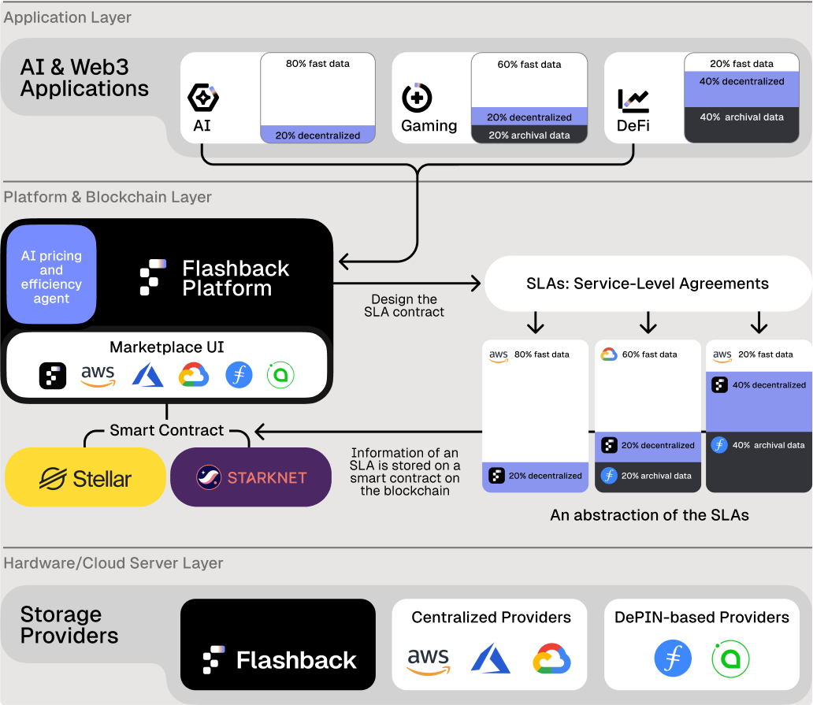

# Overview

<figure><figcaption>
General and Current Architecture of our technology (WIP)
</figcaption></figure>

Today, the development of web3 technologies has led to the emergence of new concepts that break with traditional technologies. Decentralized networks have made it possible to implement new technologies and concepts.

**Flashback** is designed as a decentralized, trust-enforced system that connects consumers and storage providers while maintaining transparency through smart contracts. **Storage Providers** and **Consumers** interact indirectly through **blockchain-based orchestrators**, which ensure compliance and streamline data and payment flows. The **Flashback Platform** registers and listings enhance discoverability, trust, and accountability, supporting a reliable decentralized storage ecosystem.

## **Application Layer**

The Flashback platform and its marketplace are the native medium of exchange for transactions in the ecosystem. Consumers pay storage providers to reserve and use storage services in an SLA. The Flashback network platform will provide a marketplace that lists the offers and manages payments.&#x20;

**Defintion of Consumers**:

* Represent individuals, organizations, or applications requiring storage solution.&#x20;
* Consumers interact with storage providers via Falshaback platform and smart contract orchestrators to store, retrieve, or manage their data.

The SLA payments depend on the requested storage, the contract duration, the cloud providers, the redundancy, the QoS level, and other parameters that will be integrated into the SLA. Payment can be made in fiat currency or cryptocurrency.&#x20;

Submitting the SLA requires paying the gas fees related to the smart contract, which will be included in the SLA fees. The SLA fees also include the general fees for the platform running costs and guarantee Flashback operations.&#x20;

The solutions in the application layer can be subscribed to different tiered levels, which will be defined during the testnet phase. The first Tier is basic storage capacity without paying the SLA fees with minimal functionalities, such as a certain range of providers and solutions. Higher tiers will provide AI-driven tools or more functionalities. &#x20;

The final values will be defined at a later stage of the platform. To resume, the different fees and payments (in fiat or cryptocurrency) from the application layer:

* **SLA Payments for Storage Providers**: Consumers pay storage providers to reserve and utilize storage services under SLAs.  SLA payments vary based on storage amount, contract duration, provider, redundancy, QoS, and other parameters.
* **Platform Operational Fees**: SLA fees, including the smart contract gas fees, also cover platform running costs to sustain Flashback’s operations, such as the marketplace and other advantages related to Flashback.
* **Platform Options**: The platform will offer a unique list of AI-driven tools and solutions to optimize the marketplace for applications and the performance of different providers.
* **Tiered-based plans**: Consumers can select different tiered plans with different options and advantages. The initial plan will offer limited access to the platform, such as a lower priority to commit to SLAs. At the same time, greater tiers will give more flexibility and possibilities with the platform, such as high-priority commitment SLAs and AI-driven tools for pricing and provider selections.&#x20;

## **Platform and Blockchain Layer**

This layer mainly manages the operations of SLA submissions, arbitrages, and other subtilities. Suppose the application pays in tokens and uses centralized Cloud providers like Amazon (tokenization of Cloud credits). In that case, the platform will then allocate a part of the received funds to a community fund and for decentralized governance. The platform will also optimize the use of smart contracts and the selection fo infrastructure providers.

### **Blockchain Layer: Smart Contract Orchestrators**

Both orchestrators communicate through the **Flashback platform**, ensuring that SLAs, payments, and quality metrics are synchronized and enforced.

* **Orchestrator for Storage Providers**:
  * Manages agreements, service-level parameters, and quality monitoring for storage providers.
  * Orchestrate the **P2P streams** by enforcing transparency and compliance in transactions.
* **Orchestrator for Consumers**:
  * Handles payments, data access permissions, and SLA terms to ensure fair usage.
  * Provides a decentralized mechanism for consumers to interact seamlessly with storage providers.

### **Flashback Platform Core**

* **Register of Certified Storage Providers**:
  * A database within the Flashback platform that lists storage providers meeting certification requirements.
  * Certification ensures providers meet quality-of-service (QoS) standards and can be trusted for SLAs.
* **Register of Certified Service Providers**:
  * Like the storage provider register, this registry certifies service providers offering auxiliary services (e.g., data migration, analytics, or compliance tools).
  * Supports a robust ecosystem by vetting reliable providers.
* **Listing**:
  * Acts as a public interface where storage and service providers are listed for consumers to browse and choose from.
  * Facilitates discovery and selection while maintaining transparency about certifications and performance ratings.
* **Access to tools, SDKs, and APIs**:
  * Provide the user interface with a complete API and support a software development kit (SDK) for customizing and improving P2P streams.&#x20;
  * AI-driven tools and features to improve the users' experience with Flashback related to pricing management, quality-of-service designs, compliance, and more.

## **Hardware/Cloud Server Layer**

### **Infrastructure Storage Provider network**

The infrastructure providers directly connected to the Flashback platform will benefit from its design. According to the currency in the SLA, the platform may participate as an intermediary of payment. Nonetheless, with the proper configuration, the payment in the SLA can be streamed directly to the infrastructure storage provider's wallet. The infrastructure storage provider can pay a subscription to be listed on the platform or stake the platform's native tokens to be authorized for operations.&#x20;

As consumers, storage providers pay the platform to access multiple AI-driven tools, allowing them to propose the best pricing according to their hardware and QoS and be competitive against other providers.

Finally, the storage providers will have access to specific tools, such as the compliance system, to refer to all the legal documents, geographical locations, general performances, etc.

The definition of an infrastructure storage provider is:

* Entities offering storage spaces, such as decentralized or traditional storage systems.&#x20;
* Responsible for offering storage capacity to consumers and must meet the platform’s quality standards or consumers' requirements.&#x20;
* Registered and certified within the Flashback platform for trust and compliance.

### **Access Layer for Existing Cloud Providers**

The platform will directly manage the centralized providers by paying them according to the consumers' needs. Naturally, these providers mainly accept fiat payments, and the platform will manage the payment transmission from the consumers to the provider. Flashback will make it possible to use the various services of these providers seamlessly to guarantee a complete user experience.&#x20;

DePin providers like Filecoin, Arweave, or StorJ accept payment in fiat but in their native tokens. Hence, the platform will manage the payment transmission from the consumer to the provider according to the currency the consumer selects. The platform will enable efficient balance of payments and harmonization with DePin tools and technologies. As DePin is decentralized, we will work more specifically with the service providers using it, and Flashback will manage the selection of services.

\
