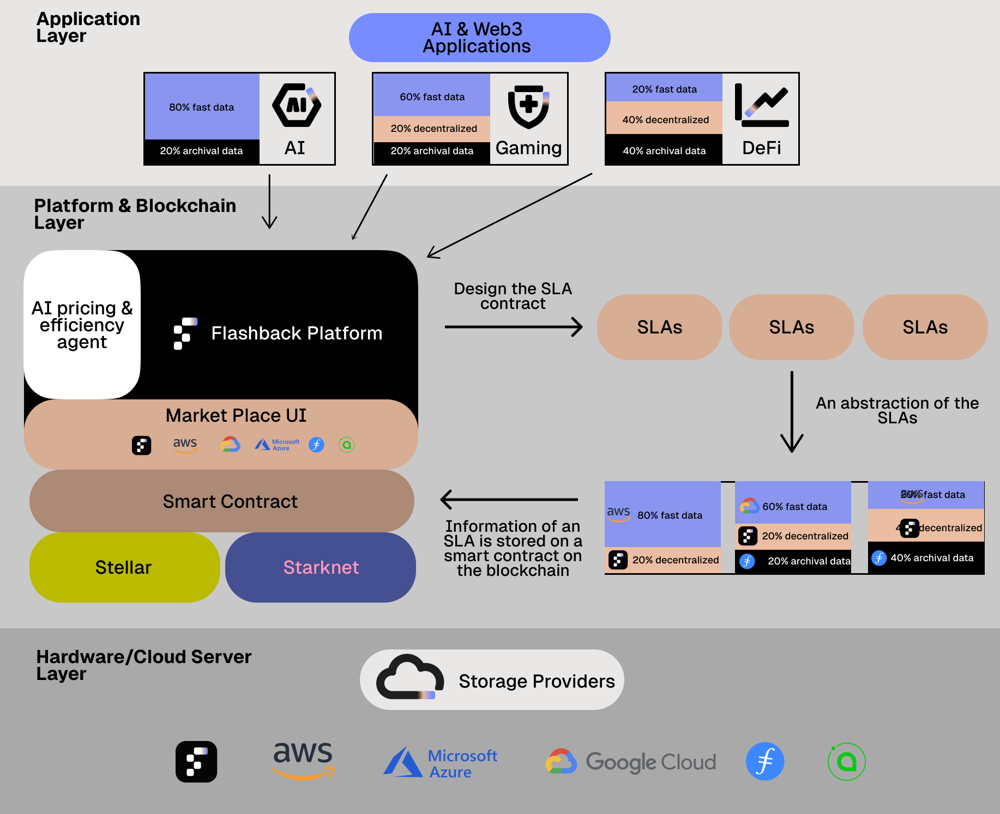

# Copy of Economy Model

<figure><figcaption>
A high-level representation of the Flashback ecosystem
</figcaption></figure>

## **Application Layer**

### **SLA Payments**

FLASH is the native medium of exchange for transactions in the ecosystem. Consumers pay storage providers in FLASH to reserve and use storage services in an SLA. The Flashback network platform will provide a marketplace that lists the offers and manages payments. The platform will offer additional functionalities to service providers, such as AI-driven recommendation tools for optimizing their storage according to their needs. Auxiliary service providers (e.g., data migration, interoperability, or analytics) receive FLASH for their specialized offerings.

**Example:** A consumer wants to reserve 1TB of storage for one month with AWS and two other providers from our network. It will then select the offers and aggregate them in an SLA. Then, the consumer will pay X FLASH according to their pricing. The payment is locked into the SLA and ready to be consumed. During the contract duration, the storage provider receives payment from the locked amount in the SLA contract according to the agreements set in the contract.

The SLA payments depend on the requested storage, the duration of the contract, the cloud providers, the redundancy, the QoS level, and other parameters that will be integrated into the SLA.&#x20;

**Token Name:** FLASH

**Utility Purpose:**\
FLASH powers the Flashback ecosystem, enabling financial transactions, incentivizing quality, enforcing compliance, and fostering governance in the decentralized storage network.

## **Core Functions of FLASH**

### **1- SLA Payments**

FLASH is the native medium of exchange for transactions in the ecosystem. Consumers pay storage providers in FLASH to reserve and use storage services in a SLA. The Flashback network platform will provide a marketplace that lists the offers and manages payments. The platform will offer additional functionalities to service providers, such as AI-driven recommendation tools for optimizing their storage according to their needs. Auxiliary service providers (e.g., data migration, interoperability, or analytics) receive FLASH for their specialized offerings.

**Example:** A consumer wants to reserve 1TB of storage for one month with AWS and two other providers from our network. It will then select the offers and aggregate them in an SLA. Then, the consumer will pay X FLASH according to their pricing. The payment is locked into the SLA and ready to be consumed. During the contract duration, the storage provider receives payment from the locked amount in the SLA contract according to the agreements set in the contract.

## **2 - Staking**

Staking ensures ecosystem stability and incentivizes quality contributions.

**Providers:** Storage providers must stake FLASH to signal their SLA commitment.

A provider must stake a minimum of 1,000 FLASH to be elligible staking 500 FLASH gains higher visibility and trust in the ecosystem.

* **For Oracles:** Oracles stake FLASH as collateral to ensure reliability in their off-chain data feeds.
  * **Example:** An Oracle staking 1,000 FLASH validates high-value transactions and data streams.

### **2 - Rewards**

Rewards incentivize storage providers and Oracles to ensure high performance and trustworthiness. Additionally to the payment, the storage providers will earn FLASH based on SLA compliance, uptime, and performance metrics. A provider maintaining 99.9% uptime receives a monthly reward of 10 FLASH per data unit.

Consumers will earn rewards in the form of specific rebates by participating in the network and the scoring systems.&#x20;

**Example:** A provider maintaining 99.9% uptime receives a monthly reward of 10 FLASH per data unit.

* **Oracles:** Earn FLASH to validate data quality, SLA adherence, and other network parameters.
  * **Example:** An Oracle verifying a data integrity check earns 5 FLASH per validation.

***

3. **Penalties (Slashing):**\
   Slashing ensures compliance by penalizing bad actors within the ecosystem.
   * **Storage Providers:** Lose a portion of their staked FLASH for failing SLA terms (e.g., downtime or data loss).
     * **Example:** A provider with significant downtime loses 20 FLASH from their stake.
   * **Consumers:** Consumers breaching terms (e.g., fraud or misuse) face penalties deducted from escrowed FLASH.

***

4. **Staking:**\
   Staking ensures ecosystem stability and incentivizes quality contributions.
   * **For Providers:** Storage providers must stake FLASH to signal their commitment to SLAs.
     * **Example:** A provider staking 500 FLASH gains higher visibility and trust in the ecosystem.
   * **For Oracles:** Oracles stake FLASH as collateral to ensure reliability in their off-chain data feeds.
     * **Example:** An Oracle staking 1,000 FLASH validates high-value transactions and data streams.

***

5. **Governance:**\
   FLASH holders influence ecosystem decisions, ensuring decentralized control.
   * **Proposals:** FLASH holders vote on changes to SLA standards, pricing mechanisms, and more.
     * **Example:** A vote on adjusting the penalty rate for SLA violations requires participation from staked FLASH holders.

***

#### **Token Flows**

1. **Storage Transactions:**
   * Consumers lock FLASH in escrow via the Orchestrator Smart Contract to reserve storage.
   * Payments are released to providers upon successful SLA completion, verified by Oracles.
   * **Example Flow:**
     * **Consumer:** Locks 100 FLASH for a 1TB reservation.
     * **Provider:** Receives 90 FLASH after SLA compliance.
     * **Orchestrator Fee:** 5 FLASH is allocated to the Flashback treasury.
     * **Oracle:** Earns 5 FLASH for validating SLA adherence.

***

2. **Rewards Distribution:**
   * Providers and Oracles earn FLASH for contributing to ecosystem health.
   * **Example Flow:**
     * A provider maintaining 99.9% uptime earns 50 FLASH in monthly rewards.
     * An Oracle verifying 100 SLAs earns 10 FLASH.
   * Rewards are sourced from transaction fees and ecosystem incentives.

***

3. **Penalty and Slashing Mechanisms:**
   * FLASH is slashed from providers or consumers failing to meet SLA terms.
   * Slashed tokens are redistributed as rewards or burned to ensure token scarcity.
   * **Example Flow:**
     * A provider fails to meet uptime SLA, losing 10% of their staked 500 FLASH.
     * 50% of the slashed tokens (25 FLASH) is redistributed to compliant providers, and the remaining 25 FLASH is burned.

***

4. **Ecosystem Fees:**
   * A percentage of each transaction is allocated to the Flashback treasury for development, marketing, and governance activities.
   * **Example Flow:**
     * 5% of all storage payments go to the treasury. A consumer paying 200 FLASH contributes 10 FLASH to ecosystem development.

***

5. **Governance Token Flow:**
   * FLASH holders stake tokens to participate in governance proposals and voting.
   * **Example Flow:**
     * A governance proposal to adjust SLA metrics is submitted. FLASH holders stake a combined 1,000,000 FLASH to vote, with rewards distributed to active participants.
