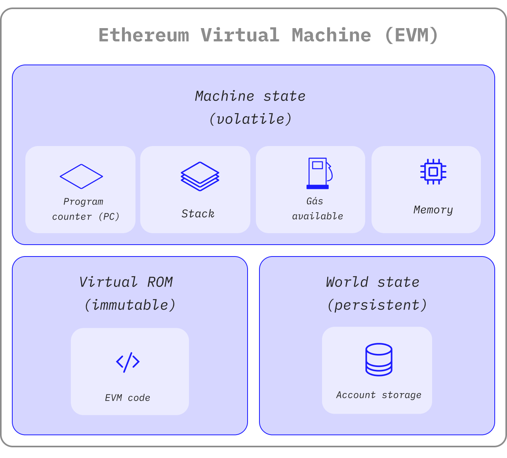

# Ethereum Virtual Machine

Flashback forked the Ethereum codebase, which inherits automatically from the Ethereum Virtual Machine (EVM). The EVM is where all EOA and smart contracts live. At any given block in the chain, the network has one and only one 'canonical' state, and the EVM defines the rules for computing a new valid state from block to block.

## A State Machine <a href="#from-ledger-to-state-machine" id="from-ledger-to-state-machine"></a>

The analogy of a 'distributed ledger' is often used to describe blockchains like Bitcoin, which enable a decentralized currency using fundamental cryptography tools. The ledger maintains a record of activity that must adhere to rules that govern what someone can and cannot do to modify the ledger. For example, a Bitcoin address cannot spend more than it previously received. These rules underpin all transactions on Bitcoin and many other blockchains.

While the network and its blockchain have its native cryptocurrency that follows almost the same intuitive rules, it also enables a much more powerful function:[ smart contracts](smart-contracts.md). This feature had to change the nature of the decentralized ledger of Ethereum (and then Flashback) by becoming a distributed [state machine](https://wikipedia.org/wiki/Finite-state\_machine).&#x20;

Network's state is a large data structure that holds not only all accounts and balances but a _machine state_, which can change from block to block according to a pre-defined set of rules and which can execute arbitrary machine code. The EVM defines the specific rules for changing states from block to block.

The EVM executes the transactions and manages the smart contracts. Every operation that leads to modify the machine's state requires the use of an elementary measure of computational efforts called the gas.

<figure><figcaption></figcaption></figure>

## The Virtual Machine for Developers <a href="#evm-instructions" id="evm-instructions"></a>

### The Instruction Principle <a href="#evm-instructions" id="evm-instructions"></a>

The EVM executes as a [stack machine](https://wikipedia.org/wiki/Stack\_machine) with a depth of 1024 items. Each item is a 256-bit word, chosen for ease of use with 256-bit cryptography (Keccak-256 hashes or secp256k1 signatures).

During execution, the EVM maintains a transient _memory_ (as a word-addressed byte array), which does not persist between transactions.

However, contracts contain a Merkle Patricia _storage_ trie (as a word-addressable word array), associated with the account in question and part of the global state.

Compiled smart contract bytecode executes as several EVM [opcodes](https://ethereum.org/en/developers/docs/evm/opcodes/), which perform standard stack operations like `XOR`, `AND`, `ADD`, `SUB`, etc. The EVM also implements several blockchain-specific stack operations, such as `ADDRESS`, `BALANCE`, `BLOCKHASH`, etc.

### The Different Implementation <a href="#evm-implementations" id="evm-implementations"></a>

All implementations of the EVM must adhere to the specifications described in the Ethereum yellowpaper. Over the course of Ethereum's history, the EVM has undergone several revisions, and several EVM implementations have been made in various programming languages. Here is a list of multiple standalone implementations, including:

* [Py-EVM](https://github.com/ethereum/py-evm) - _Python_
* [evmone](https://github.com/ethereum/evmone) - _C++_
* [ethereumjs-vm](https://github.com/ethereumjs/ethereumjs-vm) - _JavaScript_
* [eEVM](https://github.com/microsoft/eevm) - _C++_
* [revm](https://github.com/bluealloy/revm) - _Rust_

### The State Transition Function <a href="#the-nephele-state-transition-function" id="the-nephele-state-transition-function"></a>

The EVM behaves as a mathematical function would: Given an input, it produces a deterministic output. It, therefore, is quite helpful to more formally describe the network as having a **state transition function**:

```
Y(S, T)= S'
```

Given an old valid state `(S)` and a new set of valid transactions `(T)`, the network state transition function `Y(S, T)` produces a new valid output state `S'`

**State**: In the context of Ethereum and Flashback, the state is an enormous data structure called a [modified Merkle Patricia Trie](https://ethereum.org/en/developers/docs/data-structures-and-encoding/patricia-merkle-trie/), which keeps all EOA and smar contracts linked by [hashes ](https://www.investopedia.com/terms/h/hash.asp)and reducible to a single root hash stored on the blockchain.

**Transactions**: They are cryptographically signed instructions from accounts. There are two types of transactions: those which result in message calls and those which result in contract creation.

### Further Reading <a href="#further-reading" id="further-reading"></a>

* [Ethereum Yellowpaper](https://ethereum.github.io/yellowpaper/paper.pdf)
* [Jellopaper aka KEVM: Semantics of EVM in K](https://jellopaper.org/)
* [The Beigepaper](https://github.com/chronaeon/beigepaper)
* [Ethereum Virtual Machine Opcodes](https://www.ethervm.io/)
* [Ethereum Virtual Machine Opcodes Interactive Reference](https://www.evm.codes/)
* [A short introduction in Solidity's documentation](https://docs.soliditylang.org/en/latest/introduction-to-smart-contracts.html#index-6)
* [Mastering Ethereum - The Ethereum Virtual Machine](https://github.com/ethereumbook/ethereumbook/blob/develop/13evm.asciidoc)
