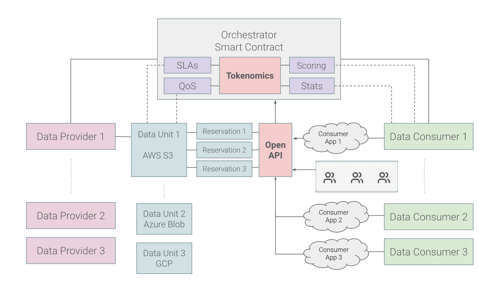

# General Workflow

This image represents a layered and interactive architecture for a decentralized platform for managing data services. Here's a breakdown of the layers and the interactions between blocks:

<figure><figcaption>
This diagram represents the 
</figcaption></figure>

## **Core Component: Orchestrator Smart Contract**

It acts as the central coordinating unit for managing data providers, consumers, and their interactions.

* **Functions**:
  * **SLAs (Service Level Agreements)**: Defines and enforces the quality of service between providers and consumers.
  * **QoS (Quality of Service)**: Tracks and ensures storage providers meet performance and reliability standards.
  * **Tokenomics**: Manages the economic incentives, including payments, rewards, and penalties in the ecosystem.
  * **Scoring**: Rates data providers based on performance, reliability, and SLA compliance.
  * **Stats**: Collects and provides usage data for transparency and optimization.

## **Data Providers/Storage Providers**

They represent storage services or infrastructure providers like AWS, Azure, Google Cloud Platform (GCP), or a physical infrastructure providers (smaller entities).

* **Data Units**:
  * Each provider has specific "Data Units," representing discrete storage capacities or services (e.g., AWS S3 buckets, Azure Blob Storage, or Custom Functions).
* **Interaction with Orchestrator**:
  * Providers register their data units with the Orchestrator Smart Contract to make their services available for reservation.
  * The Orchestrator enforces SLAs, monitors QoS, and ensures compliance.

## **Data Reservations**

* Each data unit supports multiple reservations (e.g., Reservation 1, Reservation 2, Reservation 3), representing allocations made by consumers for specific data storage needs.
* The **Orchestrator tracks these reservations** and ensures they align with SLA terms.

## **Open API in Flashback Platform**

* **Role**: Serves as the interface for communication between the Orchestrator Smart Contract, Data Providers, and Consumers.
* **Features**:
  * Allows consumers to query available data units, reserve storage, and interact with providers directly.
  * Provides a standardized way for external applications (Consumer Apps) to interact with the platform.

## &#x20;**Data Consumers/Service Providers**

* Represent entities (businesses or users) utilizing the storage services provided by the platform.
* **Consumer Applications**:
  * Applications (e.g., Consumer App 1, Consumer App 2, Consumer App 3) connect to the Open API to manage their storage needs.
  * Apps can reserve data units and interact with multiple providers through the API.
* **Interaction with Orchestrator**:
  * Consumers rely on the Orchestrator to ensure service quality, track payments, and manage disputes.

## **Interactions Between Elements**

1. **Providers ↔ Orchestrator**:
   * Providers register data units and agree to SLAs managed by the Orchestrator. Based on performance, they receive scoring and incentives.
2. **Consumers ↔ Orchestrator**:
   * Consumers reserve storage and make payments via the Orchestrator, which ensures QoS and compliance with SLAs.
3. **Consumers ↔ Open API ↔ Providers**:
   * Through the Open API, consumers directly interact with data units for file transfers and storage access.
4. **Tokenomics Layer**:
   * Integrated into the Orchestrator, it manages payments from consumers, rewards for providers, and penalties for non-compliance.

