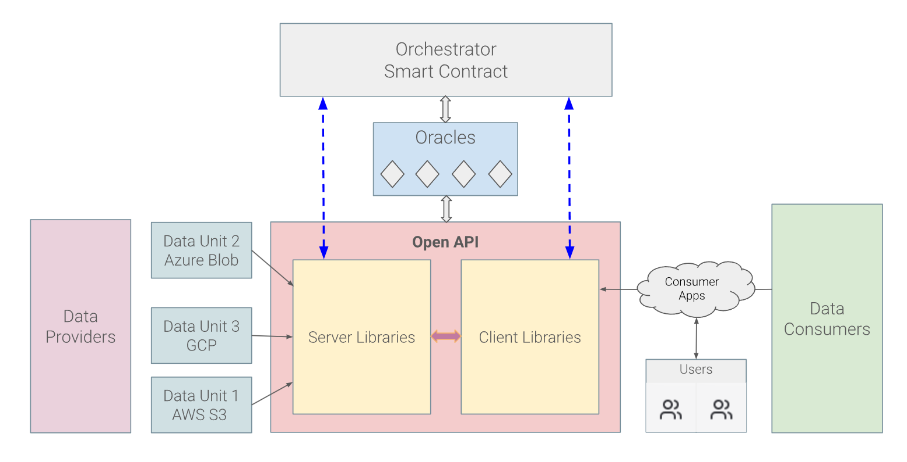

# OpenAPI of Flashback Platform

OpenAPI in the Flashback platform is built around an **Orchestrator Smart Contract**, supported by Oracles, Data Providers, an Open API, and Data Consumers.&#x20;

<figure><figcaption>
The Interactions with the OpenAPI module of the Flashback Platform
</figcaption></figure>

## **Orchestrator Smart Contract**

See [here](orchestrator-smart-contract.md).

## **Oracles**

This bridges on-chain and off-chain data that provides real-time information to the smart contract (e.g., data integrity checks, usage statistics, pricing updates). It acts as a trusted intermediary for verifying the status and quality of data services provided.

Oracles feed critical data to the Orchestrator to ensure informed decision-making and execution of smart contract logic.

## **Open API Module**

A gateway facilitating communication between data providers, consumers, and the Orchestrator.

* **Components**:
  * **Server Libraries**: Manage interactions with data providers and handle requests such as uploading, downloading, and managing data in storage units (e.g., AWS S3, Azure Blob, GCP).
  * **Client Libraries**: Provide tools for data consumers and their applications to access and utilize the services offered by providers.
* **Interaction**:
  * Server libraries integrate with data providers' infrastructures.
  * Client libraries enable consumer apps to interact with the ecosystem.

## **Data Providers**

* Connect to the Open API via the Server Libraries to register services, manage storage units, and handle consumer requests.
* Orchestrator ensures providers meet quality and performance standards through real-time Oracle updates.

## **Data Consumers**

* **Components**:
  * **Consumer Apps**: Applications built on the Client Libraries, enabling users to interact with the platform.
  * **Users**: End-users of the applications, representing the final point of interaction.
* **Interaction**:
  * Use the Client Libraries to interact with the Open API to upload, access, or manage data.
  * Rely on the Orchestrator Smart Contract to enforce service-level agreements and ensure quality.

## **Interactions Between Layers**

1. **Data Providers ↔ Open API ↔ Orchestrator**:
   * Providers register their data units via Server Libraries in the Open API.
   * The Orchestrator ensures services' availability, compliance, and quality, with Oracles feeding real-time data.
2. **Data Consumers ↔ Open API ↔ Orchestrator**:
   * Consumers interact with the Open API via Client Libraries to select and use storage services.
   * The Orchestrator manages payments, QoS enforcement, and disputes.
3. **Oracles ↔ Orchestrator ↔ Open API**:
   * Oracles provide the Orchestrator with validated off-chain data (e.g., QoS metrics, pricing, and storage status).
   * The Orchestrator ensures this data is accurately reflected in the API for both providers and consumers.

## **Key Takeaways**

* The **Orchestrator Smart Contract** ensures decentralized governance, transparency, and quality control.
* The **Open API** bridges the gap between providers and consumers, enabling seamless communication and integration.
* **Oracles** provide critical off-chain data, enhancing reliability and accuracy.
* **Data Providers** (e.g., AWS, Azure, GCP) integrate their services to the platform via Server Libraries.
* **Data Consumers** interact with the ecosystem using Consumer Apps powered by Client Libraries, ensuring easy access to services.

This architecture fosters an efficient, decentralized, and transparent ecosystem for managing storage services while balancing quality and accessibility. Let me know if you’d like to explore any component further!
