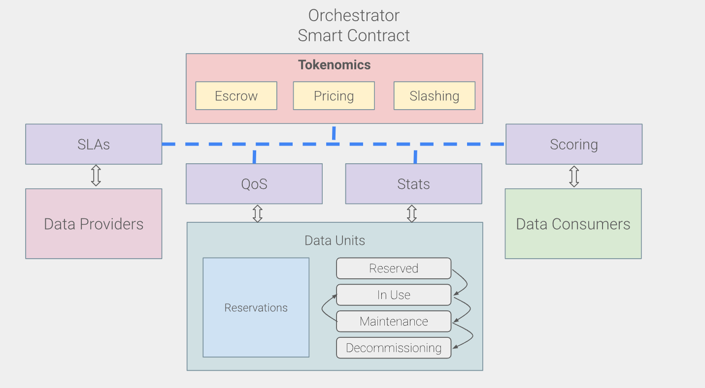

# Orchestrator

The following image represents the principle logic integrating into the smart contracts acting as an on-chain and trustless orchestrator for our network.  The **Orchestrator Smart Contract** is the backbone of the ecosystem, ensuring transparency, compliance, and fair financial transactions through tokenomics. It is critical in maintaining trust and reliability between providers and consumers.&#x20;

The orchestrator is deployed on Stellar and will be deployed on other blockchains, such as Starknet and other promising ecosystems. This multi-chain approach allows storage providers and clients to select the ecosystem they prefer and to optimize their costs and performances by balancing with the networks' load.

<figure><figcaption>
A logic scheme of our orchestrator within the Flashback network
</figcaption></figure>

## **Tokenomics**

Manages the financial and operational aspects of the ecosystem, including:

* **Escrow**: Holds payments securely until conditions in the Service Level Agreements (SLAs) are fulfilled. SLAs must properly specify the conditions of payments, and the Flashback platform allows for the best agreements.
* **Pricing**: Determines the cost of services, ensuring fairness and market-driven adjustments. Providers must dynamically adapt their pricing according to their resources and services. The integration of AI-driven pricing mechanisms is recommended, and Flashback will propose some of them.
* **Slashing:** Penalizes data providers or consumers who violate SLAs or fail to meet quality standards. This mechanism is essential to guaranteeing a healthy ecosystem. Meanwhile, the Flashback platform will be a possible provider intermediary to solve disputes.

While the project's first iteration will use existing tokens, the network will integrate its own token.

## **Data Providers**

Providers agree to predefined **Service Level Agreements (SLAs)** to ensure transparency and compliance. This operation is essential in the Flashback solution to guarantee the SLAs define performance metrics, availability, and quality standards that the providers must meet.\
\
Providers are monitored for their Quality-of-Services (QoS) metrics, which ensure they adhere to SLA requirements.

## **Data Units**

Data Units Represent the storage resources (e.g., storage servers or systems) managed by the data providers. Like the sectors in Filecoin, the providers will commit their available spaces with the QoS specifications attached to every data unit. Data units are tracked and managed via reservations, ensuring efficient allocation and availability.

* **States of Data Units**:
  * **Reserved**: Data sector allocated but not yet in use.
  * **In Use**: Actively storing data for consumers.
  * **Maintenance**: Undergoing updates or repairs.
  * **Decommissioning**: Being removed from the active pool of resources.

## **Data Consumers**

Individuals, businesses, or applications requiring storage services rely on the **Scoring** system to select providers based on reliability, performance, and cost. Scoring ensures providers are ranked fairly and transparently based on their SLA compliance and QoS metrics. Thisunique feature allows for a fair and clear understanding of providers' quality, a fundamental component of incentivizing the quality of services.

Additionally, consumers can analyze the Flashback network and the performances of data providers with the QoS metrics and select what best fits them within the data units.

## **Interactions**

1. **Data Providers ↔ SLAs ↔ Orchestrator**:
   * Providers register their resources and agree to SLAs enforced by the orchestrator.
   * QoS metrics are monitored to ensure compliance, and penalties (slashing) are applied for breaches.
2. **Data Consumers ↔ Scoring ↔ Orchestrator**:
   * Consumers use the scoring system to select reliable providers.
   * Payments are handled via the tokenomics module (escrow ensures funds are secure until SLAs are fulfilled).
3. **Orchestrator ↔ Data Units**:
   * The orchestrator tracks and manages data units through their lifecycle (reserved, in use, maintenance, decommissioning).
   * Ensures optimal resource utilization and availability for consumers.
